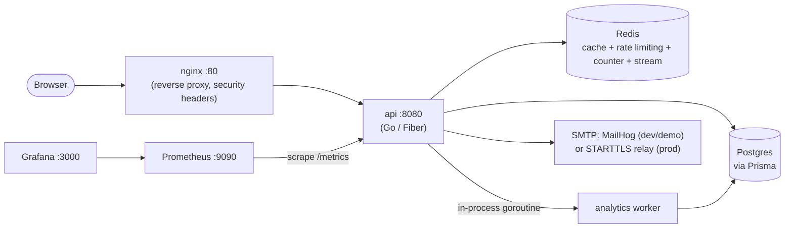

# Case study: URL Shortener

A technical description of what this system is and how it is built — the
architecture, the data path, the CI/CD pipeline, and the security decisions
behind it. This is a working, deployable demo/portfolio project; it
currently has no production deployment serving real users, and nothing in
this document should be read as claiming otherwise. For setup instructions
see `README.md` and `GETTING_STARTED.md`; for the full design-rationale
audit (including open issues and proposed improvements) see
`docs/system-design/`.

## What it does

A URL shortener: submit a long URL, get back a short code that redirects to
it. On top of that baseline it supports:

- Anonymous shortening (no account needed) or authenticated shortening
  attributed to a user
- Optional custom aliases, instead of an auto-generated code
- Optional link expiry
- Per-link click analytics (count, referrers, countries, device types,
  recent click list) gated to the link's owner
- A public, aggregate-only "top links" leaderboard
- Email-based "magic link" verification instead of passwords, followed by a
  bearer API key for authenticated requests
- Per-key rate limiting with anonymous/standard/pro tiers
- A metrics endpoint and provisioned Grafana dashboards for operational
  visibility

## Architecture

A single Go binary (`backend/cmd/api/main.go`, Fiber v2) serves the JSON
API, the built React SPA as static files, and runs the analytics worker as
an in-process goroutine — one deployable artifact, no separate worker
service to operate.

**Short-code generation** is counter-based, not hash- or random-based:
Redis `INCR` on a single global key (`internal/redis/counter.go`) hands out
a monotonically increasing integer, which `internal/shortcode/base62.go`
encodes to base62 (`0-9a-zA-Z`). This is collision-free by construction —
no uniqueness check against Postgres is ever needed on the write path — and
needs no coordination beyond Redis's own atomic `INCR`. Custom aliases take
a different, also-Redis-coordinated path: `SETNX` reserves the alias
(30s TTL) before the Postgres row is written, so two concurrent requests for
the same alias can't both "win"; the reservation is released if the
subsequent insert fails.

**The redirect hot path** never touches Postgres on a cache hit: Redis holds
`{url, id}` for each short code (TTL = 24h or the link's own expiry,
whichever is sooner); a miss falls through to Postgres and backfills the
cache. The click event itself is never written synchronously — it's pushed,
fire-and-forget, onto a Redis Stream (`urlshortener:click_events`, capped
around 100k entries) and drained separately by a consumer-group worker
(`internal/worker`, `XREADGROUP`/`XACK`, batches of 100, 5s block). A
processing failure leaves the event unacknowledged for redelivery rather
than dropping it. This decouples "redirect the user" (must be fast) from
"record analytics" (must not block the redirect, and must not get lost).

**Authentication** has no passwords or server-side sessions: a user requests
a magic link by email, the link (15-minute TTL, only its SHA-256 hash
persisted) is consumed once, and that issues an API key (`usk_<64 hex>`)
shown exactly once, with only its SHA-256 hash stored. Clients send
`Authorization: Bearer <key>`; per-link endpoints additionally check
ownership inside the handler, not just that *some* valid key was presented.

**Caching, rate limiting, ID generation, and the click-event queue all live
in the same Redis instance** but are deliberately separated into their own
files under `internal/redis/` (`cache.go`, `counter.go`, `ratelimit.go`,
`stream.go`) rather than one undifferentiated client — each has a distinct
failure mode and is reasoned about independently (e.g. rate limiting fails
*open* on a Redis error, so a cache outage degrades traffic shaping rather
than blocking all requests).

**Observability**: `prometheus/client_golang` counters/histograms exposed
at `/metrics`; a provisioned Prometheus datasource and Grafana dashboard
(request rate, redirect outcomes, rate-limit decisions) come up automatically
with `docker compose up`, plus basic alert rules (API down, high 5xx rate).

**Reverse proxy**: nginx terminates the single public entrypoint (`:80`),
adding security headers and gzip, and is the only service a production
deployment publishes to the internet — everything else (Postgres, Redis,
the API container directly, Prometheus, Grafana, MailHog's web UI) is
reachable only over the internal Docker network by service name.

## CI/CD pipeline

```mermaid
flowchart LR
    Dev["git push to main"] --> Test["CI: go test ./..."]
    Test --> Build["CI: docker build\n(multi-stage: Node -> Go -> Alpine)"]
    Build --> Push["CI: push image to ghcr.io\n(tags: <sha>, latest)"]
    Push -->|workflow_run: CI succeeded| Deploy["CD: self-hosted runner\nwrites .env from GH Actions Secrets"]
    Deploy --> Pull["docker compose pull"]
    Pull --> Up["docker compose up -d\nwith docker-compose.prod.yml overlay"]
    Up --> Health["poll container health,\ncurl /health through nginx"]
```

Two GitHub Actions workflows (`.github/workflows/`):

- **`ci.yml`** — on every push/PR to `main`: `go test ./...` (a real test
  failure fails the job — there is no swallow-the-exit-code fallback), then
  a Docker build of the multi-stage `backend/Dockerfile` (Node build stage →
  Go build stage → Alpine runtime). Only on push to `main` does it log in to
  `ghcr.io` (using the workflow's own `GITHUB_TOKEN`, no separate secret)
  and push the image tagged with the commit SHA and `latest`. This stage
  runs entirely on GitHub-hosted runners, free for this repo.
- **`deploy.yml`** — triggered by `ci.yml` completing successfully on
  `main` (`workflow_run`, not `push`, specifically so the deploy can't race
  ahead of a build that hasn't finished yet), or manual dispatch. It runs on
  a **self-hosted runner** (the operator's own machine): writes a real
  `.env` from GitHub Actions Secrets (values passed through step-level `env:`
  and referenced as shell variables, never interpolated directly into the
  script, with `umask 077` so the file is created non-world-readable), pulls
  the exact image `ci.yml` just built, and brings the stack up with
  `docker-compose.prod.yml` layered on top of the base compose file —
  deploying with only the base file would silently skip all of the
  hardening below. It then polls container health and curls `/health`
  through nginx, failing the job if the app doesn't actually come up.
  Triggers are deliberately restricted to `workflow_run`/`workflow_dispatch`
  and never `pull_request`, because a self-hosted runner executing
  arbitrary fork-PR code on the operator's own machine would be a direct
  compromise path.

The production overlay (`docker-compose.prod.yml`) is what turns the
dev-friendly default compose file into something safe to run on a reachable
machine:

- Strips host port publishing from Postgres, Redis, Prometheus, Grafana,
  and the API container itself — only nginx (80/443) is published; every
  other service is reachable by the others only over the internal Docker
  network by service name.
- Requires `POSTGRES_PASSWORD`/`REDIS_PASSWORD`/`CORS_ALLOWED_ORIGINS`/
  `IP_HASH_SECRET`/`MAIL_FROM`/`BASE_URL`/`GF_SECURITY_ADMIN_PASSWORD` via
  Compose's `${VAR:?...}` syntax, so a missing secret fails the deploy
  loudly instead of silently falling back to a committed dev default.
  `backend/internal/config/config.go`'s `validateForProduction()` adds a
  second, application-level check: it refuses to start if `ENV=production`
  and any secret still matches a committed placeholder value.
  `ENV=production` is itself set explicitly by the deploy workflow (not
  stored as a secret), since that's what turns this guard on at all.
  Together these mean a production boot with dev secrets fails fast at two
  independent layers rather than running quietly insecure.
- Resets the API container's `env_file` (dev loads the *entire* `.env` into
  the API process; production passes it only the specific variables it
  actually needs, so a secret meant for, say, Grafana is never exposed to
  the API process's environment).
- Keeps MailHog running but **unpublished** rather than removing it — mail
  is never delivered externally in this mode; an operator reads a
  verification link out of MailHog over an SSH tunnel
  (`ssh -L 8025:localhost:8025 ...`) and relays the code by hand. MailHog's
  web UI lists every user's verification link, so `ports: !reset []` on
  that service is a deliberate security control, not an oversight.
  Configuring `SMTP_HOST`/`SMTP_PORT`/`SMTP_USER`/`SMTP_PASSWORD` switches
  `internal/mail/mail.go` to a real relay with no code change (see below).
- Disables the automatic `prisma db push` on every boot (the base compose
  file's `migrate` service) — `db push` has no migration history and no
  rollback path, which is an acceptable convenience against throwaway dev
  data but a real risk against live production data. The override replaces
  it with a no-op that still satisfies the API container's
  `depends_on: service_completed_successfully` so the stack still starts,
  and schema changes are instead applied as a deliberate, separate,
  reviewed step.
- Deploys the exact image `ci.yml` already built and tested, rather than
  rebuilding on the deploy host — guarantees the artifact running in
  "production" is the one CI actually verified.

**Mail security**: `internal/mail/mail.go` supports two modes, selected at
runtime by whether credentials are configured. With no `SMTP_USER`/
`SMTP_PASSWORD` set, it sends plaintext/unauthenticated — the only mode
MailHog and most local dev SMTP catchers support, so local `docker compose
up` keeps working unconditionally. With credentials set (any genuinely-free
public SMTP relay requires this), it upgrades the connection with STARTTLS
and authenticates with `AUTH PLAIN` — and if the server doesn't advertise
STARTTLS support, it fails closed rather than silently falling back to
sending credentials in the clear, since `PLAIN` auth is essentially
base64-encoded plaintext over the wire.

## Demo data

This repository includes `scripts/seed-demo-data.sql`, which inserts a
handful of short links pointing at real public sites plus a plausible
spread of click-analytics rows, so a freshly stood-up dev/Codespaces
instance has something to look at instead of being empty. It is clearly
labeled demo/seed data (see that file's header and `scripts/README.md`),
checks for its own prior rows before inserting anything so it's safe to run
more than once, and is **not** referenced by any Docker, CI, or deploy
config — it only runs when someone invokes it by hand against a dev
database. Running it against the sample data used for this write-up
produced 8 demo links and roughly 2,700 simulated click events spread
non-uniformly over the 2–28 days each link had "existed" (exact counts vary
run to run, since the distribution is randomized); see `scripts/README.md`
for the exact numbers from that run. These are demo numbers describing
synthetic seed data, not traffic figures from any real deployment.

## Zero-cost posture

Every component in the CI/CD pipeline above runs on a genuinely free tier
with no card and no billing risk: GitHub Actions on GitHub-hosted runners is
free for this repo, GHCR storage/bandwidth for a public image tied to a
public repo is free, the self-hosted runner is the operator's own machine
(no cloud VM rental), and Postgres/Redis/Prometheus/Grafana/nginx are all
self-hosted open-source images with no licensing fee. See
`docs/system-design/11-cicd.md` and its ADRs for the full reasoning,
including alternatives that were considered and rejected.
