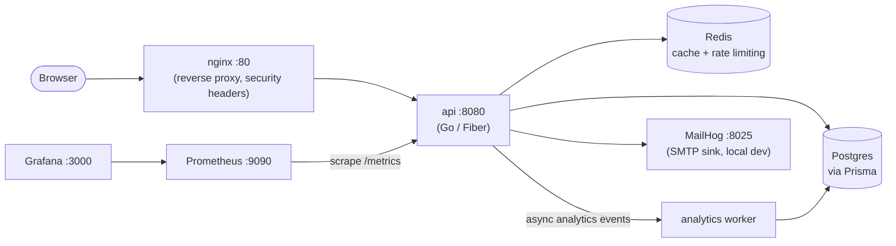

# URL Shortener

A URL shortener with link analytics, rate limiting, and a full local
observability stack — built as a Go + Fiber API backed by Postgres/Prisma
and Redis, with a Vite frontend, sitting behind nginx.

## Architecture



- **api** — Go/Fiber HTTP API: auth, short-link CRUD, redirects, rate
  limiting, analytics ingestion.
- **worker** — processes analytics events asynchronously off Redis.
- **postgres** — primary datastore, accessed via Prisma.
- **redis** — cache, rate-limit counters, event queue. Password-protected.
- **mailhog** — SMTP sink for local email testing (verification/reset mail),
  web UI at `:8025`.
- **nginx** — reverse proxy in front of the API: security headers, gzip,
  single entrypoint on `:80`.
- **prometheus / grafana** — metrics scraping and dashboards.

## Running locally

Requirements: Docker + Docker Compose. Nothing else needs to be installed
on the host — Go, Node, Postgres, Redis and Prisma all run inside
containers.

```bash
cp .env.example .env      # fill in real values for anything marked change-me
cp backend/.env.example backend/.env
docker compose up --build
```

Services:

| Service    | URL                       |
|------------|---------------------------|
| App (via nginx) | http://localhost:80    |
| API directly    | http://localhost:8080  |
| Grafana         | http://localhost:3000  |
| Prometheus      | http://localhost:9090  |
| MailHog UI      | http://localhost:8025  |

Grafana logs in with `admin` / whatever you set `GF_SECURITY_ADMIN_PASSWORD`
to in `.env`. A Prometheus datasource and an "URL Shortener Overview"
dashboard (request rate, redirect outcomes, rate-limit decisions) are
provisioned automatically.

## CI/CD

`.github/workflows/ci.yml` runs on every push/PR to `main`: `go test`, then
a Docker build of `backend/Dockerfile` (which itself runs Prisma codegen
and `go build`, so a broken build fails CI). On push to `main` it also logs
in to `ghcr.io` with the workflow's built-in token and pushes the image,
tagged with the commit SHA and `latest`.

`.github/workflows/deploy.yml` runs on a self-hosted runner and pulls that
image, then runs `docker compose up -d` to bring up the full stack.

## Deploying to a "VM"

`deploy/` contains a container that simulates a cloud VM: Docker +
Docker Compose + a self-hosted GitHub Actions runner registered against
this repo, all running on your own machine at zero cost. The CD workflow's
`self-hosted` job executes there, so a push to `main` really does pull the
freshly built image and redeploy the stack on a host that behaves like a
real server. See `deploy/README.md` for the exact setup steps.

## Monitoring

Prometheus scrapes `/metrics` on the API every 15s; `monitoring/prometheus/alerts.yml`
defines basic alerts (API down, high 5xx rate). Grafana's provisioned
dashboard (`monitoring/grafana/provisioning/dashboards/urlshortener.json`)
visualizes request rate, redirect outcomes, and rate-limit decisions from
those same metrics.
