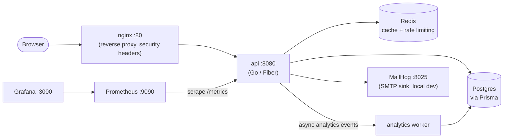

# URL Shortener

A URL shortener with link analytics, rate limiting, and a full local
observability stack — built as a Go + Fiber API backed by Postgres/Prisma
and Redis, with a Vite frontend, sitting behind nginx.

## Architecture


```mermaid
flowchart LR
    Client(["Browser"]) --> Nginx["nginx :80\n(reverse proxy, security headers)"]
    Nginx --> API["api :8080\n(Go / Fiber)"]
    API --> PG[("Postgres\nvia Prisma")]
    API --> Redis[("Redis\ncache + rate limiting")]
    API -->|async analytics events| Worker["analytics worker"]
    Worker --> PG
    API --> Mail["MailHog :8025\n(SMTP sink, local dev)"]
    Prom["Prometheus :9090"] -->|scrape /metrics| API
    Graf["Grafana :3000"] --> Prom
```

- **api** — Go/Fiber HTTP API: auth, short-link CRUD, redirects, rate
  limiting, analytics ingestion.
- **worker** — processes analytics events asynchronously off Redis.
- **postgres** — primary datastore, accessed via Prisma.
- **redis** — cache, rate-limit counters, event queue. Password-protected.
- **mailhog** — SMTP sink for local email testing (verification/reset mail),
  web UI at `:8025`.
- **nginx** — reverse proxy in front of the API: security headers, gzip,
  single entrypoint on `:80`.
- **prometheus / grafana** — metrics scraping and dashboards.

## Running locally

Requirements: Docker + Docker Compose. Nothing else needs to be installed
on the host — Go, Node, Postgres, Redis and Prisma all run inside
containers.

```bash
cp .env.example .env      # fill in real values for anything marked change-me
cp backend/.env.example backend/.env
docker compose up --build
```

Services:

| Service    | URL                       |
|------------|---------------------------|
| App (via nginx) | http://localhost:80    |
| API directly    | http://localhost:8080  |
| Grafana         | http://localhost:3000  |
| Prometheus      | http://localhost:9090  |
| MailHog UI      | http://localhost:8025  |

Grafana logs in with `admin` / whatever you set `GF_SECURITY_ADMIN_PASSWORD`
to in `.env`. A Prometheus datasource and an "URL Shortener Overview"
dashboard (request rate, redirect outcomes, rate-limit decisions) are
provisioned automatically.

## Running in GitHub Codespaces (demo)

For showing the app running with a live public link, without any machine of
your own:

1. **Code → Codespaces → Create codespace on main.** `.devcontainer/`
   installs Docker-in-Docker, generates `.env`/`backend/.env`, points
   `BASE_URL`/`CORS_ALLOWED_ORIGINS` at this codespace's own forwarded URL,
   and brings the whole stack up — no manual steps.
2. **Ports tab → port 80 → Port Visibility → Public.** This is the only port
   that should ever be made public — everything else (Postgres, Redis, the
   api container, Prometheus, Grafana, MailHog's UI) defaults to private,
   same rule as the hardened production overlay below.
3. Open the forwarded URL for port 80 — that's the live app.
4. To read a verification email: **Ports tab → port 8025 → open in
   browser.** Keep this port private; its web UI lists every user's
   verification link.

This is a **demo environment, not a production deployment**: GitHub's free
tier gives ~60 core-hours/month on a 2-core codespace, it auto-suspends after
~30 minutes idle, and `pg_data` lives only inside that codespace — delete or
rebuild it and the data is gone. It runs the plain `docker-compose.yml`
(MailHog visible, no secret hardening), not the production overlay. For an
always-on public deployment with real secrets, see `DEPLOY.md`.

## CI/CD

`.github/workflows/ci.yml` runs on every push/PR to `main`: `go test`, then
a Docker build of `backend/Dockerfile` (which itself runs Prisma codegen
and `go build`, so a broken build fails CI). On push to `main` it also logs
in to `ghcr.io` with the workflow's built-in token and pushes the image,
tagged with the commit SHA and `latest`.

## Monitoring

Prometheus scrapes `/metrics` on the API every 15s; `monitoring/prometheus/alerts.yml`
defines basic alerts (API down, high 5xx rate). Grafana's provisioned
dashboard (`monitoring/grafana/provisioning/dashboards/urlshortener.json`)
visualizes request rate, redirect outcomes, and rate-limit decisions from
those same metrics.

## Demo data

To make a freshly-created local or Codespaces instance look populated
(sample short links + click analytics) instead of empty, see
`scripts/seed-demo-data.sql` and `scripts/README.md`. It's demo/seed data
only, clearly labeled as such, safe to run more than once, and is never run
automatically by Docker, CI, or the deploy pipeline — it is **not** a
production seeding tool.

## Case study / write-up

For a fuller technical write-up of the architecture, the CI/CD pipeline,
and the security decisions behind the production hardening, see
`CASE_STUDY.md`. For the full design-rationale audit (current state vs.
proposed improvements, ADRs, known issues) see `docs/system-design/`.
