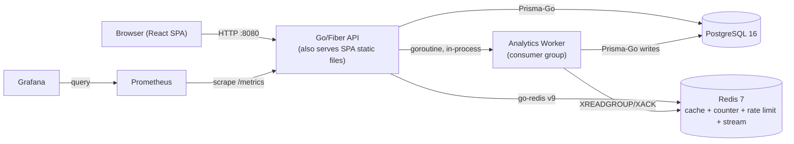
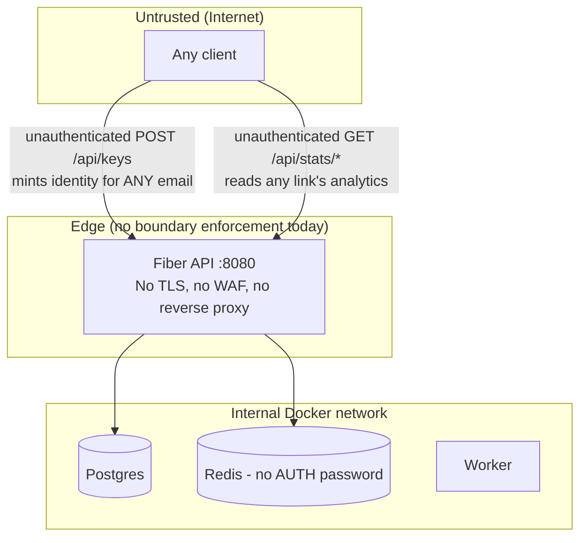
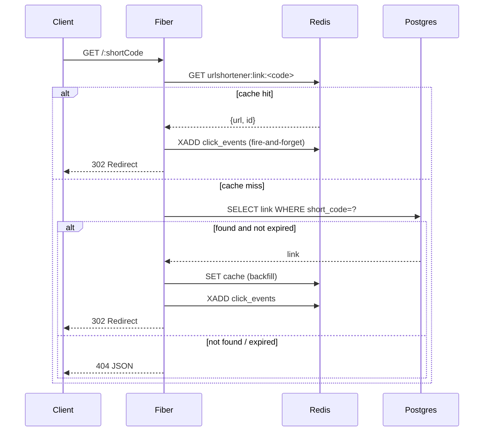
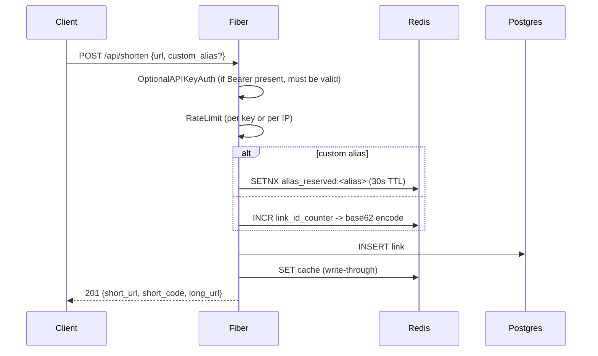
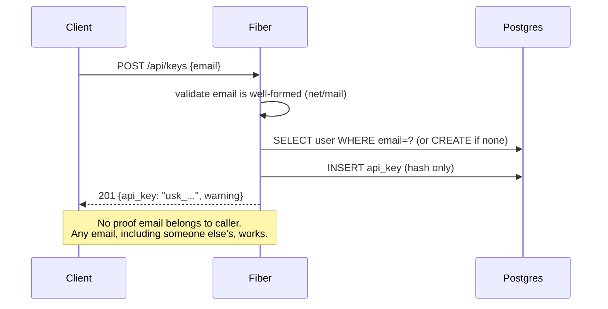
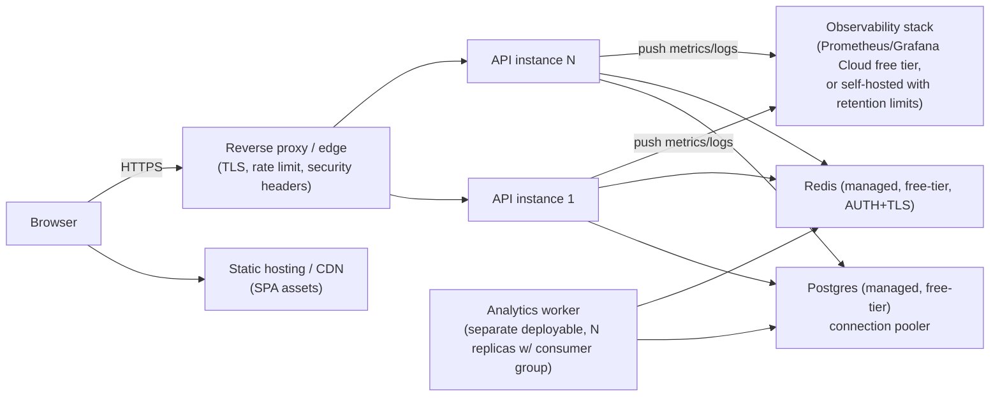
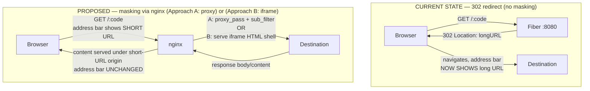

# 02 — High-Level Design

## CURRENT STATE — System Context

All 5 runtime components (postgres, redis, api, prometheus, grafana) run as sibling containers in one `docker-compose.yml`, communicating over the default Compose network by service name (`postgres`, `redis`, `api`). No reverse proxy, no TLS termination, no separate frontend server in the containerized deployment — Vite's dev server on `:5173` is used only for local frontend development.

## CURRENT STATE — Components & Responsibilities

| Component                                                   | Responsibility                                                                                           | Notes                                                                                                         |
| ----------------------------------------------------------- | -------------------------------------------------------------------------------------------------------- | ------------------------------------------------------------------------------------------------------------- |
| Fiber HTTP server (`cmd/api/main.go`)                       | Route registration, middleware chain, static file + SPA serving                                          | Single process, single binary                                                                                 |
| `internal/handlers`                                         | Request parsing/validation, orchestration                                                                | Thin — delegates to store/redis                                                                               |
| `internal/middleware`                                       | CORS, recover, access log, 2x metrics middleware, optional API-key auth, rate limit                      | Order matters: auth must run before rate-limit (rate limiter reads `c.Locals`)                                |
| `internal/store` (interfaces) + `internal/db` (Prisma impl) | Persistence abstraction over Postgres                                                                    | Clean interface segregation (LinkStore/UserStore/ApiKeyStore/ClickEventStore/StatsStore) — a genuine strength |
| `internal/redis`                                            | Cache-aside cache, atomic ID counter, alias reservation, sliding-window rate limiter, click-event stream | All cross-cutting infra concerns are centralized here                                                         |
| `internal/worker`                                           | Single goroutine, single named consumer (`worker-1`), drains stream into Postgres                        | Not horizontally scaled today (see Reliability doc)                                                           |
| React SPA                                                   | Login (mint/import API key), Dashboard (create/list/"delete" links), Stats, Top Links, Admin (metrics)   | All auth state lives in `localStorage`, no refresh/rotation                                                   |

## CURRENT STATE — Trust Boundaries

**Key trust-boundary weakness (current state):** the only "authentication" primitive (`POST /api/keys`) requires no proof of email ownership, so the boundary between "anonymous internet user" and "authenticated user X" is not actually enforceable — see `05-security.md` Finding SEC-01.

## CURRENT STATE — Request Flows

### Redirect flow (hot path)

### Shorten flow

### "Auth" flow (current — not real authentication)

### Failure flows (current state, as implemented)

- **Redis down:** `RateLimit` fails open (`middleware/ratelimit.go:53-56`) — requests proceed unlimited. `GetLongURL` cache miss path falls through to Postgres, so redirects still work but at full DB load. `NextID`/`ReserveAlias` for shortening will hard-fail (`resolveShortCode` returns an error), so **all URL creation stops** if Redis is unreachable — single point of failure.
- **Postgres down:** Redirects served from cache continue to work; cache misses 500. Shortening always fails (writes go to Postgres synchronously). Health check (`/health`) does **not** check Postgres at all, so an orchestrator/load balancer using `/health` would see the instance as healthy while writes are completely broken.
- **Analytics worker crashes:** Click events accumulate in the Redis Stream (capped at `MAXLEN ~100000`, `stream.go:54`) until a new process with the same consumer name reconnects; if the API process itself restarts, the worker restarts with it (it's a goroutine of the same binary, not a separate service) — no independent scaling or restart of the worker.

## PROPOSED PRODUCTION STATE — System Context

Key differences from current state, each justified below and elaborated in the numbered docs:

1. **Decouple the analytics worker from the API process** — today it's a goroutine tied to API lifecycle; production should let it scale/restart independently (justified by reliability: a worker crash loop must not be able to affect redirect latency, and by scalability: click volume and redirect volume scale differently).
2. **Introduce a reverse proxy / edge layer for TLS + security headers** — the current server is plain HTTP with hardcoded localhost CORS; this is a hard blocker for any real deployment (see `06-deployment.md`).
3. **Real authentication** (email verification, e.g. magic link) before password-based or higher-privilege actions are trusted — current identity-minting endpoint is a critical security gap (see `05-security.md` SEC-01).
4. **Bounded, indexed analytics queries** replacing full-table scans — required at even moderate scale (see `07-scalability.md`).
5. **Postgres included in health checks**, with separate liveness/readiness semantics — required for correct autoscaling/orchestration behavior (see `08-reliability.md`).

No component is added merely for appearance; each is tied to a concrete, cited problem in another doc, per CLAUDE.md §3.

## PROPOSED PRODUCTION STATE — nginx reverse proxy (with optional URL masking/cloaking)

**Status: PROPOSED design option only — not approved, not implemented (CLAUDE.md §31). Requires explicit user approval before any nginx config or code is written.**

### Why nginx at all

Independent of masking, `06-deployment.md` already flags plain-HTTP Fiber-on-:8080 with hardcoded-localhost CORS as a hard deployment blocker. Placing nginx (or any reverse proxy) in front of the API cleanly solves, in one place:

- TLS termination (currently none — CURRENT STATE has no TLS anywhere)
- Security headers (HSTS, `X-Content-Type-Options`, etc. — see `05-security.md`)
- Env-driven routing/CORS origin handling instead of hardcoded values baked into the Go binary

This part is low-risk and orthogonal to masking — it does not change redirect semantics for the default case.

### The masking/cloaking requirement — mechanism, honestly stated

The requested behavior is: when a user visits a short URL, the **short URL stays in the browser address bar** while the real long-URL content is what's actually shown. This is **not achievable with the current mechanism.**

**Current behavior (confirmed in code — `backend/internal/handlers/redirect.go`):** `GET /:shortCode` returns an HTTP **302 Found** with a `Location:` header pointing at the long URL. A 302 is a browser-level instruction: "go fetch this other URL instead." The browser navigates there and **replaces the address bar with the long URL.** No amount of nginx configuration changes this — masking is fundamentally incompatible with an HTTP redirect, because the redirect *is* the browser being told to change its own address bar.

To keep the short URL visible, the response at `/:shortCode` must instead **be** the destination's content, not a pointer to it. Two conceptual approaches:

**Approach A — nginx reverse-proxying the destination content (`proxy_pass`).**
nginx (or the API, with nginx handling header rewriting) makes a server-side request to the long URL and streams its response body back to the browser as if it were the short-URL page's own content. Conceptually this needs:
- `proxy_pass` to the resolved destination for that path
- `proxy_set_header`/response header stripping, since destination sites frequently set `X-Frame-Options` / `Content-Security-Policy` (which don't apply here since there's no iframe, but the destination may also set `Content-Security-Policy: frame-ancestors` or caching/cookie headers that assume they own the origin)
- `sub_filter` to rewrite the destination page's relative links/asset paths (`/css/app.css`, absolute-path links, etc.) so they still resolve correctly when served from the short-domain origin instead of the destination's own origin — without this, most non-trivial sites will render broken (missing CSS/JS, broken internal links)
- This is **not a static nginx.conf directive list you can just drop in** — real destinations vary wildly in how "proxyable" they are (some use protocol-relative URLs, JS-injected asset paths, service workers tied to their own origin, etc.), so this degrades to "works for simple pages, breaks unpredictably for complex ones."

**Approach B — full-page iframe wrapper served at the short-URL path.**
`/:shortCode` returns a tiny HTML page (served by the API or nginx directly) containing a full-viewport `<iframe src="{longURL}">`. The address bar shows the short URL because the top-level document never navigates; the iframe navigates internally.
- Much simpler to implement than Approach A.
- **Breaks entirely** for any destination that sends `X-Frame-Options: DENY`/`SAMEORIGIN` or a CSP `frame-ancestors` directive (a large fraction of real sites, including most major platforms) — the browser will refuse to render the iframe content, showing a blank frame or browser error, with no clean nginx-side workaround (stripping those headers requires nginx to intercept the *destination's* response, i.e. Approach A's proxying again, at which point you're doing both).

### Trade-offs and caveats — read before approving

This is a **deliberate product trade-off, not a free technical win**:

1. **Broken destinations are common and undetectable in advance.** Any destination with frame-busting headers (Approach B) or non-relative/JS-driven asset loading (Approach A) will render broken or blank, with no generic fix — you'd need per-destination special-casing.
2. **Security/legal exposure.** Proxying or iframing third-party content the operator doesn't own raises questions of consent, copyright, and liability for what's displayed under the operator's domain. This is materially different from "redirect to their URL" (which is what URL shorteners have always legally been understood to do).
3. **Phishing/cloaking classification risk.** Browsers, Safe Browsing lists, and corporate URL scanners specifically look for "URL A displays content from URL B while masking B" as a phishing/cloaking signature — this is the same technique used maliciously to disguise destinations. A legitimate masking shortener risks being flagged, blocklisted, or having its domain reputation damaged.
4. **Bandwidth/cost.** Approach A means every redirect's response bytes flow through this server rather than a 302 (a few hundred bytes). At scale this is materially more bandwidth (relevant given the ₹0/$0 constraint and free-tier bandwidth caps in `06-deployment.md`).
5. **SEO and analytics harm.** Search engines and analytics tools generally expect a redirect chain to resolve to the canonical destination URL; masking breaks canonicalization, referrer semantics, and destination-side analytics (the destination sees traffic originating from the proxy/iframe, not organic referral data).
6. **No partial version exists.** There's no configuration that masks "a little" — it's redirect (current, robust, universally compatible) or proxy/iframe (fragile, higher-risk, opt-in per the trade-offs above).

### Flow comparison

### Decision status

Not decided. This section documents the mechanism and its honest trade-offs so the user can approve or reject with full information, per CLAUDE.md §31. See `adr/0005-nginx-reverse-proxy-and-deployment.md` for the recorded decision options.
