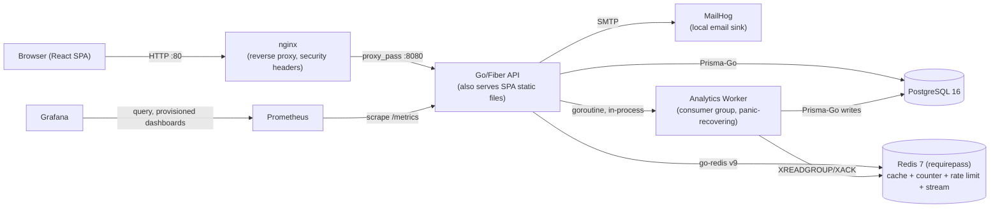
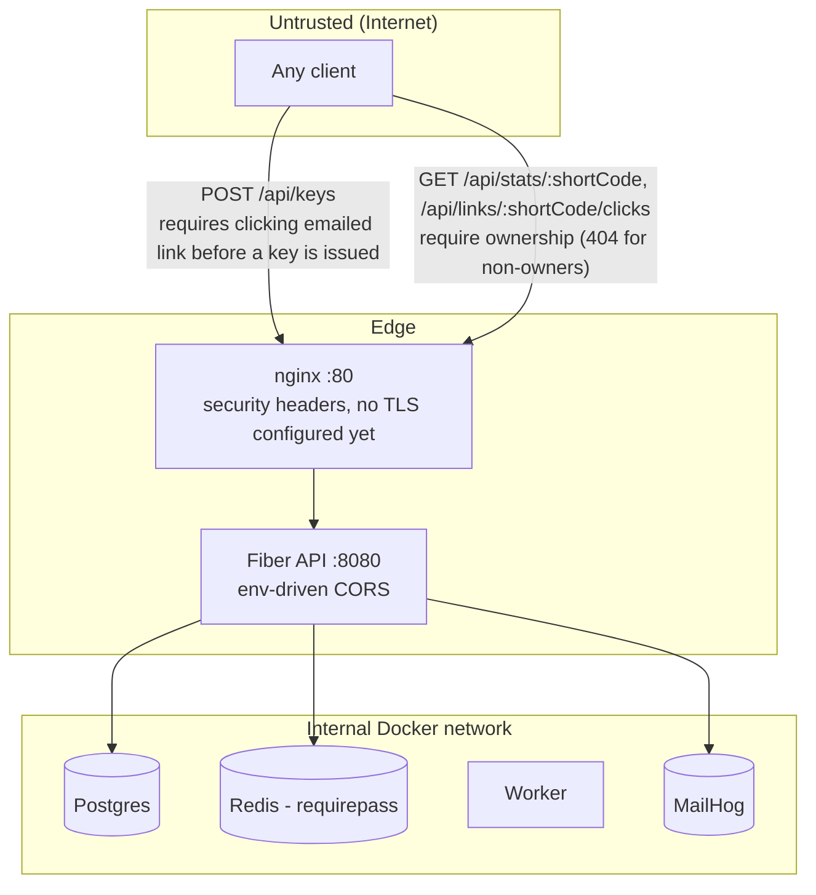
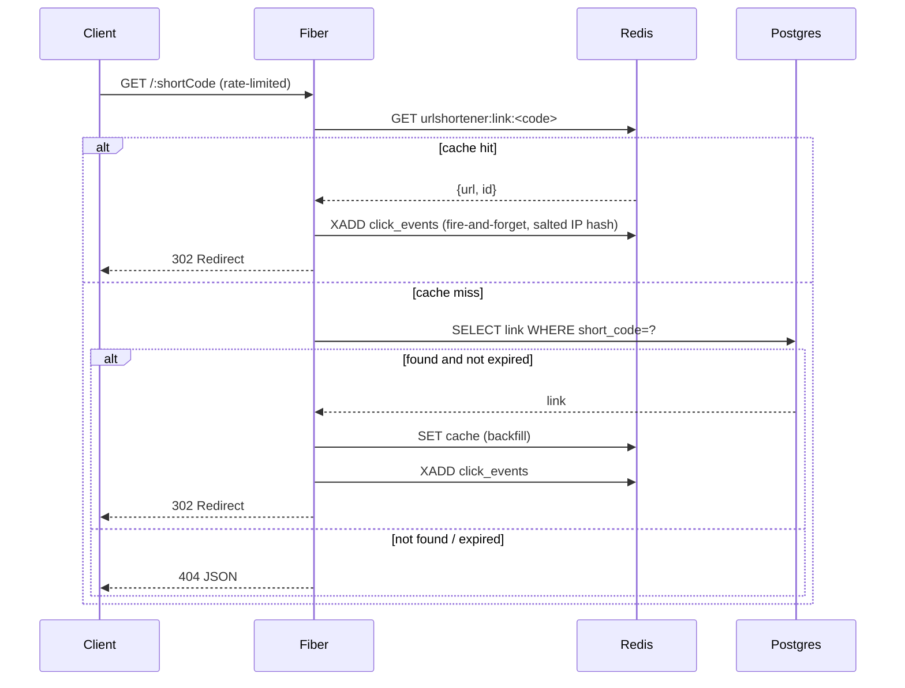
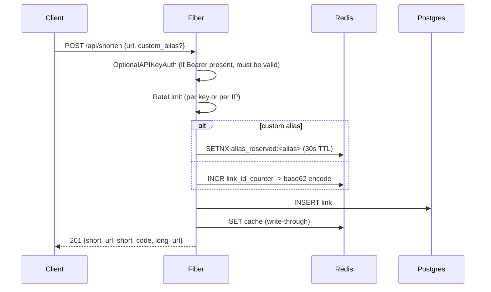
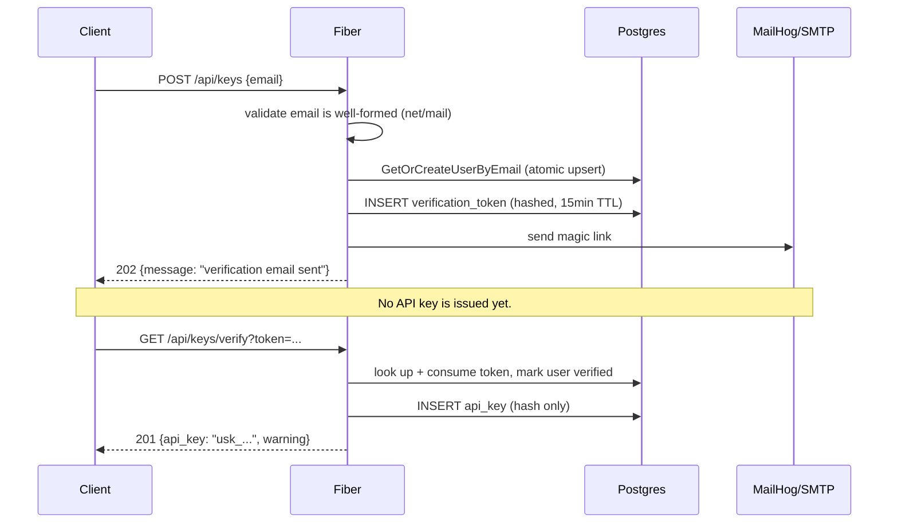
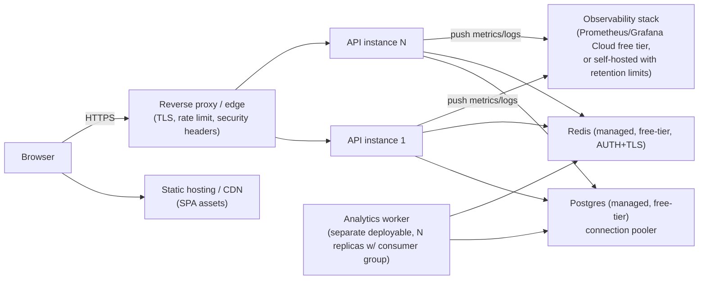
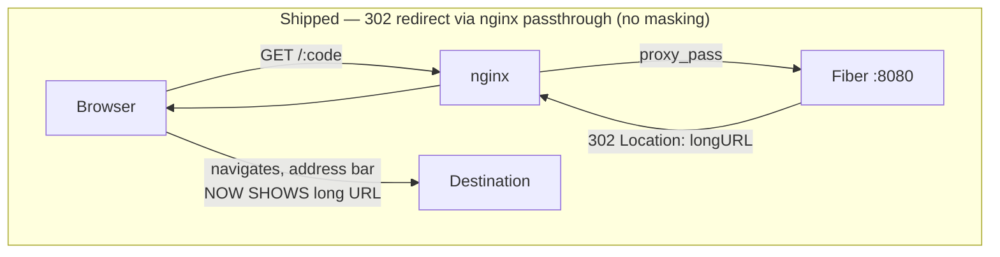

# 02 — High-Level Design

Status markers used below follow `01-project-overview.md`'s vocabulary (✅ Implemented / 🔜 Proposed / ⛔ Removed / 🐞 Known issue / ❓ Unknown).

## CURRENT STATE — System Context

All services (postgres, redis, mailhog, a one-shot `migrate` job, api, nginx, prometheus, grafana) run as sibling containers in one `docker-compose.yml`, communicating over the default Compose network by service name. nginx is the single public entrypoint (`:80`), terminating in front of the API and adding security headers (see `05-security.md` SEC-07, resolved). Vite's dev server on `:5173` is used only for local frontend development outside Docker.

## CURRENT STATE — Components & Responsibilities

| Component                                                   | Responsibility                                                                                           | Notes                                                                                                         |
| ------------------------------------------------------------- | --------------------------------------------------------------------------------------------------------- | --------------------------------------------------------------------------------------------------------------- |
| nginx                                                        | Reverse proxy, TLS-ready termination point (no TLS configured yet — see `06-deployment.md`), security headers, gzip | Single public entrypoint on `:80`; proxies to `api:8080` |
| Fiber HTTP server (`cmd/api/main.go`)                       | Route registration, middleware chain, static file + SPA serving                                          | Single process, single binary                                                                                 |
| `internal/handlers`                                         | Request parsing/validation, orchestration                                                                | Thin — delegates to store/redis                                                                               |
| `internal/mail`                                              | SMTP-based email sending for magic-link verification                                                      | Backed by MailHog locally; real SMTP creds would be needed for a real deployment                              |
| `internal/middleware`                                        | CORS (env-driven), recover, access log, 2x metrics middleware, optional/required API-key auth, rate limit | Order matters: auth must run before rate-limit (rate limiter reads `c.Locals`)                                |
| `internal/store` (interfaces) + `internal/db` (Prisma impl) | Persistence abstraction over Postgres                                                                    | Clean interface segregation (LinkStore/UserStore/ApiKeyStore/ClickEventStore/StatsStore/VerificationTokenStore) — a genuine strength |
| `internal/redis`                                             | Cache-aside cache, atomic ID counter, alias reservation, sliding-window rate limiter, click-event stream, salted IP hashing | All cross-cutting infra concerns are centralized here                                                         |
| `internal/worker`                                             | Single goroutine, single named consumer (`worker-1`), panic-recovering, drains stream into Postgres        | Not yet horizontally scaled (see `08-reliability.md`, ADR-0003)                                               |
| React SPA                                                    | Login (mint API key via email verification), Dashboard (create/list/delete links), Stats, Top Links, Admin (metrics) | Auth state lives in `localStorage`, no refresh/rotation                                                        |

## CURRENT STATE — Trust Boundaries

The identity-minting and per-link-analytics gaps flagged in the original audit are resolved (see `05-security.md` SEC-01/SEC-02a/SEC-02b). Remaining edge gaps: no TLS is configured anywhere yet (deployment-dependent, see `06-deployment.md`), and `/metrics`/`/health` are still unauthenticated (acceptable for a private scrape target, a real exposure if the port is published — see `05-security.md` SEC-07).

## CURRENT STATE — Request Flows

### Redirect flow (hot path)

### Shorten flow

### Email-verified auth flow (✅ Implemented — replaces the original "no real auth" flow)

This closes the original SEC-01 finding: an API key is only issued after the caller proves control of the mailbox by following the emailed link.

### Failure flows (current state, as implemented)

- **Redis down:** `RateLimit` fails open (`middleware/ratelimit.go`) — requests proceed unlimited. `GetLongURL` cache miss path falls through to Postgres, so redirects still work but at full DB load. `NextID`/`ReserveAlias` for shortening will hard-fail (`resolveShortCode` returns an error), so **all URL creation stops** if Redis is unreachable — single point of failure, unchanged from the original audit (see `08-reliability.md`).
- **Postgres down:** Redirects served from cache continue to work; cache misses 500. Shortening always fails (writes go to Postgres synchronously). `/health` now checks **both** Redis and Postgres (✅ Implemented, closes the original gap — see `08-reliability.md`), so an orchestrator using `/health` will correctly see the instance as degraded.
- **Analytics worker crashes:** Click events accumulate in the Redis Stream (capped at `MAXLEN ~100000`, `stream.go`) until the worker reconnects. The worker's `run()` loop now wraps itself in `recover()` (✅ Implemented) so a panic in click-event processing restarts the loop instead of crashing the whole API process. It still runs as a goroutine of the API binary rather than an independently deployable/scalable process (🔜 Proposed, see ADR-0003).

## PROPOSED PRODUCTION STATE — System Context

Remaining gaps from the current state, each tracked in its own doc:

1. **Decouple the analytics worker from the API process** (🔜 Proposed) — today it's a goroutine tied to API lifecycle (panic-recovering, but still coupled); production should let it scale/restart independently (see `08-reliability.md`, ADR-0003).
2. **TLS termination** (🔜 Proposed) — nginx is now in front of the API and adds security headers (✅ Implemented), but no TLS certificate/HTTPS config exists yet; this is deployment-target-dependent (see `06-deployment.md`).
3. **Bounded, indexed analytics queries for `GetTopLinks`/`GetLinkStats`** (🐞 Known issue, fix proposed) replacing the remaining full-table scans — `GetRecentClickEvents` was already fixed this way (see `03-data-model.md`, `07-scalability.md`, ADR-0001).
4. **Horizontal scaling / a real deployment target** (🔜 Proposed / currently undecided) — see `06-deployment.md`.

No component is added merely for appearance; each is tied to a concrete, cited problem in another doc.

## nginx reverse proxy — status

**✅ Implemented (proxy/headers scope).** nginx now sits in front of the API (`nginx/nginx.conf`, wired into `docker-compose.yml`), providing security headers (`X-Frame-Options`, `X-Content-Type-Options`, `Referrer-Policy`, a `Content-Security-Policy`), gzip, and a single public entrypoint on `:80`. TLS termination is not yet configured (deployment-target-dependent).

### The masking/cloaking option — not adopted, documented for completeness

Earlier design discussion considered whether nginx should also provide URL masking/cloaking (keeping the short URL visible in the browser address bar while serving the destination's content underneath). **This was not adopted** — the shipped `nginx.conf` retains the standard 302-redirect semantics, with the masking config commented out and explicitly documented as disabled by default (see the "OPTIONAL / DISABLED BY DEFAULT" block in `nginx/nginx.conf`). The mechanism and trade-offs are preserved below for reference, in case this is revisited.

**Current, shipped behavior (`backend/internal/handlers/redirect.go`):** `GET /:shortCode` returns an HTTP **302 Found** with a `Location:` header pointing at the long URL. A 302 is a browser-level instruction: "go fetch this other URL instead." The browser navigates there and **replaces the address bar with the long URL.** No amount of nginx configuration changes this — masking is fundamentally incompatible with an HTTP redirect, because the redirect *is* the browser being told to change its own address bar.

To keep the short URL visible, the response at `/:shortCode` would instead need to **be** the destination's content, not a pointer to it. Two conceptual approaches were evaluated and rejected (kept here as design history):

**Approach A — nginx reverse-proxying the destination content (`proxy_pass`).**
nginx makes a server-side request to the long URL and streams its response body back to the browser as if it were the short-URL page's own content. This needs `proxy_pass` to the resolved destination, response-header stripping (destinations often set `X-Frame-Options`/CSP `frame-ancestors` or caching/cookie headers that assume they own the origin), and `sub_filter` to rewrite the destination's relative asset/link paths — real destinations vary wildly in how "proxyable" they are, so this degrades to "works for simple pages, breaks unpredictably for complex ones."

**Approach B — full-page iframe wrapper served at the short-URL path.**
`/:shortCode` returns a tiny HTML page containing a full-viewport `<iframe src="{longURL}">`. Simpler than Approach A, but **breaks entirely** for any destination sending `X-Frame-Options`/CSP `frame-ancestors` (a large share of real sites) — no clean nginx-side workaround without also proxying (converging back to Approach A).

**Why this was rejected as the default:**

1. **Broken destinations are common and undetectable in advance** for both approaches.
2. **Security/legal exposure** — proxying or iframing third-party content the operator doesn't own raises consent/copyright/liability questions, materially different from "redirect to their URL."
3. **Phishing/cloaking classification risk** — "URL A displays content from URL B while masking B" is a recognized phishing signature; a legitimate masking shortener risks blocklisting/reputation damage.
4. **Bandwidth/cost** — Approach A means every redirect's response bytes flow through this server rather than a ~few-hundred-byte 302, relevant given the ₹0/$0 constraint and free-tier bandwidth caps.
5. **SEO/analytics harm** — masking breaks canonicalization and destination-side referrer analytics.
6. **No partial version exists** — it's redirect (current, robust, universally compatible) or proxy/iframe (fragile, higher-risk).

### Flow comparison (current, shipped behavior)

See `adr/0005-nginx-reverse-proxy-and-deployment.md` for the recorded decision.
