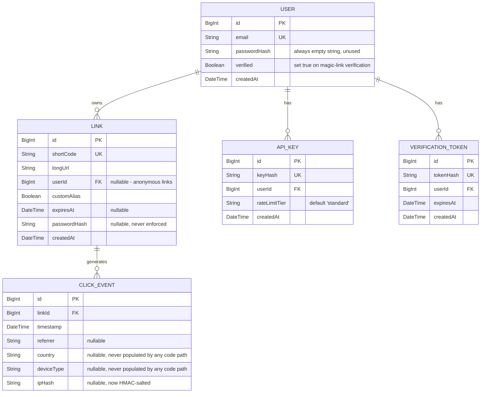

# 03 — Data Model

Status markers follow `01-project-overview.md`'s vocabulary.

## CURRENT STATE — Entities (from `backend/prisma/schema.prisma`)

`VerificationToken` (✅ Implemented) is new since the original audit — it backs the magic-link email verification flow (see `02-high-level-design.md`, `05-security.md` SEC-01).

## Keys, indexes, constraints (as declared in schema.prisma)

| Table                 | Constraint/Index                                                  | Evidence           |
| --------------------- | ------------------------------------------------------------------ | ------------------- |
| `users`               | `email` unique                                                     | `schema.prisma`     |
| `links`               | `short_code` unique; `@@index([userId])`                          | `schema.prisma`     |
| `verification_tokens` | `token_hash` unique; `@@index([userId])`                           | `schema.prisma`     |
| `api_keys`            | `key_hash` unique; `@@index([userId])`                             | `schema.prisma`     |
| `click_events`        | `@@index([linkId])`; `@@index([timestamp])`; `@@index([linkId, timestamp])` | `schema.prisma`     |

### Indexes: what was fixed, what remains

- **✅ Implemented: `click_events(link_id, timestamp)` composite index**, plus a standalone `timestamp` index. This is exactly the index the original audit proposed.
- **✅ Implemented: `GetRecentClickEvents` now uses it** — the query is DB-side `ORDER BY timestamp DESC LIMIT N` (`prisma_store.go`), not an unbounded fetch + in-Go sort. This closes the original "no composite index, no bounded query" finding for this one method.
- **🐞 Known issue, unchanged: `GetTopLinks` and `GetLinkStats` do not use the new index** — both still call `FindMany()` with no `WHERE`/`LIMIT` pushed to SQL and aggregate/sort the full result set in Go (`prisma_store.go`). The index exists; the two highest-impact query rewrites proposed in ADR-0001 were not applied to these two methods. See `07-scalability.md` for the resulting risk profile — this is the single most important thing still worth fixing.
- **`links.expires_at`** still has no index. Low priority since the primary lookup is by unique `short_code`; would matter if a scheduled cleanup job is ever added (still 🔜 Proposed, none exists).

## Data lifecycle / retention

- **No TTL/retention policy for `click_events`** (unchanged 🐞 Known issue). They accumulate forever in Postgres; only the Redis Stream buffer is bounded (`MAXLEN ~100000`, a transient queue, not the table itself).
- **Link deletion is now real.** ✅ Implemented: `DELETE /api/links/:shortCode` (owner-gated) performs a hard delete (`ls.DeleteLink`) and invalidates the Redis cache entry. This closes the original "frontend fakes delete, no backend route" finding — the frontend's delete button now calls the real endpoint (`DashboardPage.jsx handleDelete`). Note this is a **hard delete**, not the soft-delete (`deleted_at`) design the original audit proposed — acceptable, but means deleted links' click events lose their parent link row (a cascade/orphan question worth resolving if this becomes an issue: `schema.prisma`'s `ClickEvent.link` relation is required, so Postgres FK behavior — not verified in this pass — governs what happens to a deleted link's click events).
- **Expired links are still not purged**, only filtered out at read time in `GetLinkByShortCode`/`GetUserLinks`. `GetTopLinks` also filters expired links (confirmed in code); `GetLinkStats`/`GetRecentClickEvents` operate on a single already-resolved link and don't need to re-check expiry. This is largely consistent now, unlike the original audit's finding of a blanket inconsistency — worth re-verifying once the `GetTopLinks`/`GetLinkStats` full-scan queries are rewritten (see above), since the filtering logic will need to move with them.

## Transactions

- `CreateLink` writes are single-statement — fine, unchanged.
- **No transaction wraps "reserve alias in Redis + create Link in Postgres."** Unchanged from the original audit: a best-effort compensating `ReleaseAlias` call on Postgres insert failure, with the reservation self-expiring after 30s if the process crashes in between — an acceptable, deliberate saga-style trade-off, not a true atomic operation.
- **`GetOrCreateUserByEmail` race condition — ✅ Fixed.** The original audit flagged a check-then-act (`FindUnique` then `CreateOne`) race where two concurrent `POST /api/keys` calls for a brand-new email could both attempt to create the user, with the loser getting a generic `500`. This is now implemented as a single atomic `User.UpsertOne(...).Create(...).Update(...)` call (`prisma_store.go`, with an explicit comment noting the fix), which cannot race in the same way.

## Consistency between Redis and Postgres

- **Write-through, not write-behind** (unchanged): `CreateLink` → Postgres, then best-effort `SetLongURL` cache populate. Falls back to Postgres on cache-write failure — acceptable, eventually consistent by design.
- **Cache invalidation on delete — ✅ Implemented.** `DeleteLink` now calls `Redis.InvalidateLongURL` after a successful delete (`stats.go DeleteLink`), so `InvalidateLongURL` is no longer dead code — it has exactly one call site, the new delete path.
- **Stale cache on expiry**: unchanged trade-off — a link's cache TTL is capped at the default (24h) or the link's own `expires_at`, whichever is sooner. Not a correctness bug (Postgres remains the source of truth on miss).

## PROPOSED — Remaining data model work

1. **Rewrite `GetTopLinks`/`GetLinkStats` as real SQL aggregate/`LIMIT` queries** (via raw SQL through Prisma, since prisma-client-go's query builder has no native `GROUP BY`), matching the pattern already proven for `GetRecentClickEvents`. This remains the single highest-impact production-readiness fix outstanding — see `07-scalability.md`, ADR-0001.
2. **Add a scheduled cleanup job** (or a nightly `DELETE FROM click_events WHERE timestamp < now() - retention_window`) to bound analytics table growth, with a documented retention period (still no default proposed — labeled ASSUMPTION pending a decision).
3. **Either implement or remove `passwordHash` on both `User` and `Link`.** Still unresolved — the fields remain schema-only and unenforced, which is a security-hygiene risk (an operator could reasonably assume password-protected links work). Decision still pending.
4. **`role` column on `User`** (or a separate `admin_users` allow-list) to back real privilege separation for `/admin` — still not implemented (see `05-security.md` SEC-04, unresolved).
5. **Decide the FK/cascade behavior for `click_events` when a link is deleted**, now that link deletion is real — confirm whether existing click events for a deleted link are retained, cascaded, or orphaned, and whether that matches the intended retention/analytics story.
