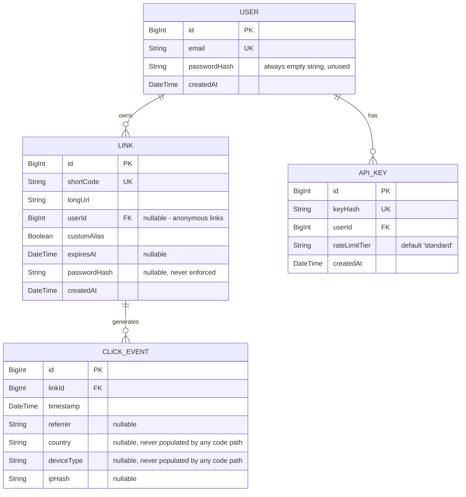

# 03 — Data Model

## CURRENT STATE — Entities (from `backend/prisma/schema.prisma`)

## Keys, indexes, constraints (as declared in schema.prisma)

| Table          | Constraint/Index                         | Evidence              |
| -------------- | ---------------------------------------- | --------------------- |
| `users`        | `email` unique                           | `schema.prisma:29`    |
| `links`        | `short_code` unique; `@@index([userId])` | `schema.prisma:13,23` |
| `api_keys`     | `key_hash` unique; `@@index([userId])`   | `schema.prisma:40,46` |
| `click_events` | `@@index([linkId])`                      | `schema.prisma:60`    |

### Missing indexes (identified problem)

- **No index on `click_events.timestamp`.** Every daily-bucket / time-window analytics query (`GetLinkStats`'s `DailyClicks` grouping) has to scan and sort in application memory anyway (see below), but even a future SQL-side rewrite would need `(link_id, timestamp)` composite index to avoid a sort.
- **No composite index `(link_id, timestamp DESC)`** — needed for both `GetRecentClickEvents` (currently unbounded scan) and any future "clicks in the last N days" query.
- **No index supporting `GetTopLinks`** (needs an aggregate `COUNT(*) GROUP BY link_id ORDER BY count DESC LIMIT N` — currently done by loading every row into Go memory instead, see Performance below).
- **`links.expires_at`** has no index despite `GetLinkByShortCode` checking it on every redirect-miss lookup; low priority since the primary lookup is by unique `short_code`, but a scheduled cleanup job (`DELETE FROM links WHERE expires_at < now()`) — which does not exist — would need one.

## Data lifecycle / retention — CURRENT STATE

- **No TTL/retention policy for `click_events`.** They accumulate forever. The only bound anywhere in the system is the _Redis Stream's_ `MAXLEN ~100000` (a transient buffer, not the Postgres table) — `stream.go:54`. Postgres `click_events` grows unbounded with traffic.
- **No deletion path exists for `links`** (no `DELETE` handler/route registered in `main.go` at all) — the frontend's delete button is client-state-only (see `01-project-overview.md`). This means links (and by extension their click_events, cache entries) are **never actually removable** by any user through the product today. This is both a UX bug and, combined with unbounded click_events growth, a storage-growth concern (see `07-scalability.md`).
- **Expired links are not purged**, only filtered out at read time (`prisma_store.go:103-105` in `GetLinkByShortCode`) — `GetTopLinks`/`GetUserLinks`/`GetLinkStats` do **not** apply this same expiry filter, so expired links still appear in dashboards, top-lists, and stats. This is an inconsistency bug (see `13-bugs` equivalent finding BUG-06 in the final report).

## Transactions

- `CreateLink` writes are single-statement, no explicit transaction needed given Prisma's own atomicity per call — fine.
- **No transaction wraps "reserve alias in Redis + create Link in Postgres."** If the Postgres insert fails after a successful `SETNX` reservation, the code does call `ReleaseAlias` (`shorten.go:88`) — this is a best-effort compensating action, not a real transaction, and if the process crashes between the two steps the reservation self-expires after 30s (`cache.go:97`) so it isn't permanently stuck; acceptable design given the constraints, but worth documenting as a deliberate saga-style compromise rather than a true atomic operation.
- **`GetOrCreateUserByEmail` (`prisma_store.go:110-141`) has a check-then-act race condition**: `FindUnique` then `CreateOne` is not atomic. Two concurrent `POST /api/keys` calls for a brand-new email can both see "not found" and both attempt `CreateOne`, and since `email` is `@unique`, the loser gets a Postgres unique-constraint error which is returned as a generic `500 failed to resolve user` to the second caller instead of being retried/handled as "someone else just created this, fetch it." This is a real, evidenced concurrency bug — see final report BUG list.

## Consistency between Redis and Postgres

- **Write-through, not write-behind**: `CreateLink` → Postgres, then best-effort `SetLongURL` cache populate (`shorten.go:94`, error ignored). If the cache write fails, the redirect path just falls back to Postgres on the next request — acceptable, eventually consistent by design.
- **No invalidation on update.** There is no "update a link" feature today, so this isn't currently exercised, but `redis/cache.go` does expose `InvalidateLongURL` — dead code, called from nowhere (`grep` confirms zero call sites outside its own definition).
- **Stale cache on expiry**: a link's cache TTL is capped at `defaultCacheTTL` (24h) or the link's own `expires_at`, whichever is sooner (`cache.go:70-76`) — reasonable, but note a link created with **no** `expires_at` and then this field never changing means the redirect cache is refreshed at most once per day per hot link; not a correctness bug (Postgres remains the source of truth on miss) but worth calling out as an intentional trade-off.

## PROPOSED PRODUCTION STATE — Data model changes

1. **Add `click_events(link_id, timestamp)` composite index** and rewrite `GetLinkStats`/`GetTopLinks`/`GetRecentClickEvents` as real SQL aggregate/`LIMIT` queries (via raw SQL through Prisma, since prisma-client-go's query builder has no native `GROUP BY`) instead of `FindMany()` + in-process aggregation. This is the single highest-impact production readiness fix (see Performance/Scalability findings).
2. **Add `links.deleted_at` (soft delete) and wire up `DELETE /api/links/:shortCode`** so the existing frontend delete UI becomes real, with an authorization check that the caller owns the link.
3. **Add a scheduled cleanup job** (or a nightly `DELETE FROM click_events WHERE timestamp < now() - retention_window`) to bound analytics table growth, with a documented retention period (propose starting point: 180 days, adjustable, since no compliance requirement dictates a value — labeled ASSUMPTION).
4. **Either implement or remove `passwordHash` on both `User` and `Link`.** Carrying unused schema-only fields that _look_ like they provide security (password-protected links) is itself a security-hygiene problem: an operator or auditor could reasonably assume the feature works. Recommend explicit decision in Phase 2 approval: implement password-protected links (bcrypt/argon2 on `Link.passwordHash`, prompt on redirect) or drop the column via a migration.
5. **`role` column on `User`** (or a separate `admin_users` allow-list) to back real privilege separation for `/admin`, once approved (see `05-security.md` SEC-04).
