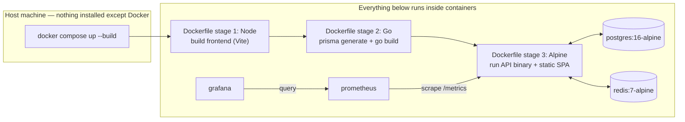

# 06 — Deployment (₹0 / $0 constraint per CLAUDE.md §20-21)

## CURRENT STATE

- **Local only.** `docker-compose.yml` runs all 5 services (postgres, redis, api, prometheus, grafana) on one host. There is no deployment target configured anywhere (no Fly.io/Render/Railway config files, no Kubernetes manifests, no `.github/workflows`).
- **Dockerfile** is a correct 3-stage multi-stage build (Node frontend build → Go backend build w/ Prisma codegen → Alpine runtime), with a documented gotcha comment about generating the Prisma client *inside* the Linux container rather than on the host to avoid an engine-binary platform mismatch (`Dockerfile:25-31`) — a genuine sign of hard-won operational knowledge.
- **Runtime image security posture**: `alpine:3.19` base (a pinned minor version, good), runs `apk add ca-certificates openssl` only. **No non-root `USER` directive** — the container runs as root by default (Alpine images default to root unless a `USER` line is added). Confirmed absent from `backend/Dockerfile`.
- **No `.dockerignore` found** at repo root or `backend/` — not independently verified as a security issue, but worth confirming before hardening (build context could include `.env` if not careful; `.gitignore` and `backend/.gitignore` do exclude `.env`, but Docker build context inclusion is governed by `.dockerignore`, not `.gitignore`).
- **CORS hardcoded to localhost** (`06-security.md` SEC-07) is the single hardest **blocker** to deploying this anywhere and having the frontend actually work against a real domain.

## PROPOSED PRODUCTION STATE — Committed deployment & CI/CD plan

> **Status: removed / superseded — deployment approach TBD.** The self-hosted-runner/simulated-VM deploy plan described in this section (and in `11-cicd.md`/`adr/0007-cicd-pipeline.md`) has been removed from the repository (`deploy/` and `.github/workflows/deploy.yml` deleted). CI (test/build, push to `ghcr.io`) remains in `.github/workflows/ci.yml`. Deployment target is undecided again and left for a future decision. The rest of this section is preserved as historical design detail.

**The deployment approach has been decided.** The full CI/CD pipeline and deploy target are documented in **`11-cicd.md`**, with the decision record (including the cloud-provider options that were evaluated and rejected) in **`adr/0007-cicd-pipeline.md`**. This section intentionally no longer presents a multi-provider menu — see `11-cicd.md` for the single, concrete design: GitHub Actions CI (`go test` → `docker build` → push to `ghcr.io`) followed by a CD stage that deploys onto a containerized, self-hosted-Actions-runner "simulated VM" running the full `docker compose` stack (`api + postgres + redis + prometheus + grafana + nginx`) on the user's own machine, at $0, with no card and no cloud account.

That plan replaces the previously-open "where do we host this" evaluation for the *deploy target*. It does not change the frontend-hosting-agnostic note below, since the committed plan serves the built SPA from the same containerized stack (via the API/nginx) rather than a separate static host.

### Explicit conflict report (per CLAUDE.md §21's requirement to surface conflicts)

The committed plan (`11-cicd.md`) resolves the card/cold-start conflicts previously flagged for cloud-hosted always-on targets (Oracle, Fly.io, GCP with min-instances≥1) by not using an external cloud host at all — the "VM" is a container the user runs themselves, so there is no external biller to trigger. The trade-off accepted in exchange, recorded in `adr/0007-cicd-pipeline.md`, is that the deployed stack is **not continuously reachable at a public URL**; the showcase artifact is a reproducible pipeline run plus screenshots/recordings of the live dashboard, not a persistent public link. This is the accepted, honest zero-cost trade-off — not silently resolved, but decided.

### What must change in the repo before the committed plan can work

1. Env-driven CORS origins (`06-security.md` SEC-07) — hardcoded localhost origins will reject the deployed frontend's real domain.
2. Env-driven `DATABASE_URL`/`REDIS_ADDR`/`REDIS_PASSWORD` already exist (`config.Load()` reads from env with fallbacks) — this part is **already deployment-ready**, no change needed. Confirmed good practice.
3. A non-root `USER` in the Dockerfile's final stage (hardening, not a functional blocker, but standard for any container pushed to a registry that scans for CVEs/misconfig, several of the free registries above run baseline image scanning).
4. Health check must include Postgres (currently Redis-only) so a platform's own health-check-based restart/traffic-routing logic (Render, Cloud Run, etc. all support HTTP health checks) behaves correctly — see `08-reliability.md`.
5. A production-safe Redis config: TLS + `requirepass`/managed-provider auth token — Upstash and most managed Redis free tiers provide this by default; the current `docker-compose.yml` local setup would need `REDIS_PASSWORD` wired through (it already reads `RedisPassword` from config into `redis.New()`, `client.go:16-19` — the plumbing exists, it's just unset in `.env.example`).

The committed CI/CD + deploy plan is documented in full in `11-cicd.md` — see that document for how these items are exercised end-to-end in the pipeline's CD stage.

## PROPOSED PRODUCTION STATE — Deploy target (committed)

**Status: PROPOSED — pending Phase 3 implementation. See `11-cicd.md` for the full design and `adr/0007-cicd-pipeline.md` for the decision record.**

The repository already runs the full stack (`postgres`, `redis`, `api`, `prometheus`, `grafana`) as sibling containers in one `docker-compose.yml` (see `02-high-level-design.md` CURRENT STATE). Adding the proposed nginx reverse-proxy layer (see `02-high-level-design.md`'s nginx section) means the deployable unit becomes a 6-service Compose stack: `api + postgres + redis + prometheus + grafana + nginx`.

The committed deploy target for this stack is a **containerized Linux "server" that simulates a cloud VM**, running Docker and hosting a **self-hosted GitHub Actions runner** — entirely on the user's own machine, at $0, with no card and no cloud account. The CD stage of the CI/CD pipeline (`11-cicd.md`) deploys onto it by pulling the freshly-built image from `ghcr.io` and running `docker compose up -d`. Prometheus and Grafana run inside that same environment, providing the live-dashboard showcase artifact.

This decision was made after evaluating Oracle Cloud Always-Free, Render, and Google Cloud Run as always-on cloud hosting candidates — all three were **rejected** (card-at-signup requirements for Oracle/Cloud Run, or cold-start behavior undermining the showcase goal for Render). The full options-considered/decision/trade-offs record lives in `adr/0007-cicd-pipeline.md`; `adr/0005-nginx-reverse-proxy-and-deployment.md`'s deployment-target section is superseded by that ADR (its nginx-scope decision is unaffected).

### Decision status

Decided. See `adr/0007-cicd-pipeline.md` and `11-cicd.md`. Pending Phase 3 implementation.

## PROPOSED PRODUCTION STATE — Fully containerized operations & process management

**Status: PROPOSED — not approved, not implemented. See `adr/0006-containerized-operations-and-process-management.md` for the full decision record. Process-management detail (crash-restart, healthchecks, graceful shutdown) lives in `08-reliability.md`; this section covers the build/run lifecycle and the recommended showcase path.**

### Why this section exists

The user asked whether PM2 should be used and wants a Docker-first (CLAUDE.md §4), fully containerized operational story. `adr/0006` records the answer: **PM2 is rejected** — it is a Node.js process manager, and this stack has no runtime Node process to manage (Go binary backend, static-file frontend). The correct approach is container-native process management (`restart: unless-stopped` + healthchecks + the graceful-shutdown code already in `main.go:134-141`), detailed in `08-reliability.md`. This section documents the complementary piece: making sure *everything*, not just process supervision, happens inside containers.

### Containerized build → run → monitor lifecycle

The repo already does most of this correctly:

- **Build**: `backend/Dockerfile` is a 3-stage build (Node stage builds the Vite frontend → Go stage builds the binary, with Prisma codegen run *inside* the Linux container specifically to avoid a host/container engine-binary mismatch, per the documented comment at `Dockerfile:25-31` → Alpine runtime stage). Nothing is built on the host today, and nothing should be — no local `go build`, no local `npm run build`, no local `prisma generate` needed for the containerized path.
- **Run**: `docker-compose.yml` runs all 5 services (`postgres`, `redis`, `api`, `prometheus`, `grafana`) as containers communicating over the Compose network by service name (already correctly avoids `localhost` between containers — see the `DATABASE_URL`/`REDIS_ADDR` overrides in the `api` service's `environment` block).
- **Monitor**: Prometheus scrapes `/metrics` from the `api` container; Grafana queries Prometheus — both already run as containers, no host-installed monitoring agent.

### The one unavoidable caveat, stated honestly

"Fully containerized" cannot mean literally zero bytes touch the host: Docker images, layers, and named volumes (`pg_data`, `redis_data`) are stored by the Docker engine in its own storage area on the host filesystem — this is inherent to how Docker works, not a gap in this project's setup, and no configuration eliminates it. The achievable and meaningful goal, which this repo already meets, is: **no Go/Node/Postgres/Redis/Prisma installed directly on the host, no build artifacts written into the project tree outside what Docker manages, and the project tree itself stays clean** (confirmed: the multi-stage Dockerfile builds frontend and backend inside containers, not via a host-run build script that drops `dist/` or a Go binary into the repo).

### Committed path: pipeline-driven Compose deploy on the simulated-VM runner (strictly $0, no card)

This is realized concretely by the committed CI/CD pipeline in `11-cicd.md`/`adr/0007-cicd-pipeline.md`: a GitHub Actions CD stage runs `docker compose pull && docker compose up -d` (or, if a Swarm step-up per `adr/0006` is later adopted, `docker stack deploy -c docker-compose.yml <stack>`) on the self-hosted-runner container that stands in for a cloud VM. The steps that make the result demonstrable:

1. The pipeline deploys the full containerized stack onto the simulated-VM runner via `docker compose up -d` (automated, on every push — not a manual local step).
2. Exercise the app end-to-end (create links, hit redirects, generate traffic) so Prometheus/Grafana have real data.
3. Capture screenshots/recordings of the green CI/CD pipeline run, the live Grafana dashboards, the running `docker compose ps`/healthcheck output, and the app itself.
4. Publish the repository — including `docs/system-design/` and the captured screenshots — as the GitHub artifact. This is the demonstrable proof of a working, observable, containerized, *pipeline-deployed* system without requiring a continuously-reachable public host.

This path is **strictly $0, requires no card, and has zero automatic-billing risk** — it never leaves the user's own machine, GitHub's free product tier, and Docker's local storage. See `11-cicd.md` for the full committed design.

### Decision status

Decided. See `adr/0006-containerized-operations-and-process-management.md` for the recorded PM2-rejection and orchestration-step-up decision, and `adr/0007-cicd-pipeline.md` for the committed deploy pipeline this showcase path now runs through.
