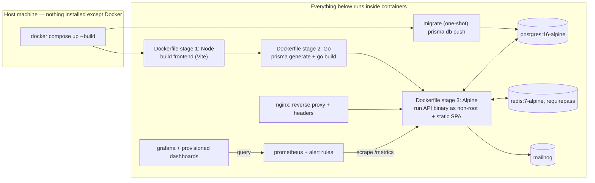

# 06 — Deployment (₹0 / $0 constraint)

Status markers follow `01-project-overview.md`'s vocabulary.

## Current status, stated plainly

- **CI builds, tests, and publishes the image.** `.github/workflows/ci.yml` runs `go test ./...`, builds the Docker image, and — on push to `main` — pushes it to **GitHub Container Registry (`ghcr.io`)**, tagged with the commit SHA and `latest`.
- **A self-hosted-runner / simulated-VM deployment approach was designed, implemented, and then removed.** It deployed the built image onto a self-hosted GitHub Actions runner container acting as a stand-in "cloud VM," running the full Compose stack via `docker compose up -d`. That CD workflow (`deploy.yml`) and its supporting `deploy/` directory have been deleted from the repository. Nothing in the current repo references them.
- **Deployment target is currently undecided.** There is no live, publicly reachable deployment of this project anywhere. The working, demonstrable path today is running `docker compose up` locally (see `GETTING_STARTED.md` Option B) — that path exercises the full stack: nginx, API, Postgres, Redis, MailHog, Prometheus, and Grafana, with provisioned dashboards.
- This is the single current status for this topic; `11-cicd.md` and the ADRs below describe how it got here and preserve the design history, but do not restate it as if it were still an open, undecided question layered under contradictory notes.

## CURRENT STATE — Repository facts

- **Dockerfile** is a correct 3-stage multi-stage build (Node frontend build → Go backend build w/ Prisma codegen → Alpine runtime), with a documented gotcha comment about generating the Prisma client *inside* the Linux container rather than on the host to avoid an engine-binary platform mismatch.
- **✅ Non-root runtime user.** The final stage creates and switches to `appuser`/`appgroup` (`USER appuser`) — this closes the original audit's "container runs as root" finding.
- **✅ nginx reverse proxy.** `nginx/nginx.conf` is the single public entrypoint (`:80`), adding security headers and gzip in front of the API. TLS is not configured (no certificate/HTTPS block) — that remains deployment-target-dependent.
- **✅ CORS is env-driven** (`CORS_ALLOWED_ORIGINS`) — closes the original "hardcoded localhost, hard blocker to deployment" finding.
- **✅ Health check now covers Postgres and Redis** (see `08-reliability.md`) — a platform's own health-check-based restart/routing logic would now behave correctly.
- **✅ Redis is password-protected** (`requirepass` via `REDIS_PASSWORD`) in `docker-compose.yml`. **🐞 Postgres's password is still hardcoded in plaintext** in the compose file rather than sourced from `.env` — see `05-security.md` SEC-05.
- **No `.dockerignore` found** at repo root or `backend/` — not independently verified as a security issue, but worth confirming before hardening (`.gitignore` excludes `.env`, but Docker build-context inclusion is governed by `.dockerignore`, which doesn't exist).

## What must still change before any real deployment target is chosen

1. ~~Env-driven CORS origins~~ — ✅ done.
2. Env-driven `DATABASE_URL`/`REDIS_ADDR`/`REDIS_PASSWORD` — ✅ already existed, still fine.
3. ~~A non-root `USER` in the Dockerfile's final stage~~ — ✅ done.
4. ~~Health check must include Postgres~~ — ✅ done.
5. **A production-safe Redis config (TLS + auth)** — 🔶 partially done: `requirepass` auth is wired up; TLS is not, and would depend on the chosen hosting/managed-Redis provider.
6. **Move the Postgres password out of the compose file into `.env`**, and reconsider host port publishing for `postgres`/`redis` before any non-local deployment — 🐞 still open, see `05-security.md` SEC-05.
7. **A real deployment target and a corresponding CD stage** — 🔜 currently undecided, see below.

## Deployment target — history and current status

**Current status: undecided.** No deployment target is committed. What follows is preserved as design history, not as an active plan.

A self-hosted-runner "simulated VM" approach was evaluated, chosen, implemented, and then removed:

- **Evaluated and rejected as cloud targets** (all required a card and/or undermined the "always-on" goal): Oracle Cloud Always-Free (card required at signup despite genuinely free compute), Render free tier (card-free, but cold starts after 15 min idle), Google Cloud Run (card required at signup regardless of usage staying free). Full reasoning preserved in `adr/0005-nginx-reverse-proxy-and-deployment.md` and `adr/0007-cicd-pipeline.md`.
- **Adopted, then removed**: a containerized self-hosted GitHub Actions runner, standing in for a cloud VM entirely on the user's own machine, with a CD stage that ran `docker compose pull && docker compose up -d` on it. This was genuinely $0 with no card and no external biller, at the cost of not being a continuously publicly-reachable URL (the showcase artifact would have been screenshots/recordings of a live pipeline run and dashboard, not a persistent public link).
- **Why it was removed**: not itself a technical failure of the design — the decision to remove it and revisit the deployment question was made after implementation. `deploy/` and `.github/workflows/deploy.yml` were deleted; `.github/workflows/ci.yml` (test/build/push to `ghcr.io`) was kept.
- Full decision record: `adr/0007-cicd-pipeline.md` (the pipeline ADR, now marked accepted-then-reverted) and `adr/0005-nginx-reverse-proxy-and-deployment.md` (the original provider-menu evaluation, superseded by 0007, itself now reverted).

Any future deployment-target decision starts fresh from this point — the provider evaluations above remain useful background (the card/cold-start trade-offs they document don't change), but no target is currently chosen or in progress.

## Fully containerized operations & process management

**Status: ✅ Implemented**, per `adr/0006-containerized-operations-and-process-management.md`. This is independent of the deployment-target question above and unaffected by the CD removal — it describes the local Compose stack, which is exactly what's running today.

- **Build**: `backend/Dockerfile` is a 3-stage build (Node → Go w/ Prisma codegen inside the container → Alpine runtime). Nothing is built on the host.
- **Run**: `docker-compose.yml` runs `postgres`, `redis`, `mailhog`, a one-shot `migrate` job (applies the Prisma schema via `db push` before `api` starts), `api`, `nginx`, `prometheus`, and `grafana` as containers communicating over the Compose network by service name.
- **Monitor**: Prometheus scrapes `/metrics` from `api`; Grafana queries Prometheus using provisioned dashboards and datasources (`monitoring/`) — both run as containers.
- **Process management**: `restart: unless-stopped` (crash-restart) + Docker `healthcheck` blocks on every service + the existing SIGTERM handling in `main.go` (graceful shutdown) — the container-native equivalent of PM2, which was evaluated and explicitly rejected (see `adr/0006`, since this stack has no Node.js runtime process to supervise).

The one unavoidable caveat, stated honestly: "fully containerized" cannot mean literally zero bytes touch the host — Docker images, layers, and named volumes (`pg_data`, `redis_data`) live in Docker's own storage area on the host. This is inherent to Docker, not a gap in this project's setup. The achievable and meaningful goal — no Go/Node/Postgres/Redis/Prisma installed directly on the host, no build artifacts written into the project tree — is met.

## Showcase path today

The reproducible, demonstrable artifact right now is: clone the repo, `docker compose up --build`, exercise the app (create links, hit redirects, generate traffic), and observe the live Grafana dashboards and green CI runs on GitHub. This requires no cloud account, no card, and no external service beyond GitHub's free CI/registry tier. See `GETTING_STARTED.md` for the exact steps.
