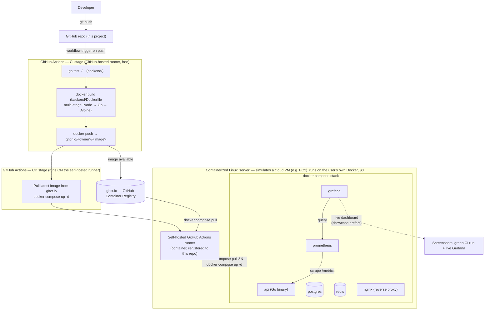

# 11 — CI/CD & Deployment Pipeline (₹0 / $0 constraint per CLAUDE.md §20-21)

## Status

**PROPOSED — pending Phase 3 implementation.** This is the single, committed pipeline design for this project — not a menu of alternatives. It has been decided; what remains is building it. See `adr/0007-cicd-pipeline.md` for the decision record, including options that were considered and rejected.

## Overview

The project ships a fully automated, fully containerized, fully local, $0 CI/CD pipeline. On every push to the GitHub repository:

1. **CI** runs the backend test suite and builds the multi-stage Docker image.
2. The built image is pushed to **GitHub Container Registry (ghcr.io)**.
3. **CD** deploys that image onto a **self-hosted GitHub Actions runner** — a Linux container that plays the role of a cloud VM (e.g. an AWS EC2 instance), running under the user's own Docker on the user's own machine.
4. The full stack (`api + postgres + redis + prometheus + grafana + nginx`) comes up via `docker compose up` on that simulated-VM host.
5. Prometheus + Grafana, already running in that same environment, provide live dashboards — the pipeline's showcase artifact.

No cloud account, no card, no paid tier, and no service outside this repository and the user's own machine is required anywhere in this flow.

## End-to-end pipeline diagram

## Stages, described concretely

### 1. CI — test, build, push (GitHub-hosted runner)

Triggered on every `push` (and `pull_request`) against the repo, via a workflow under `.github/workflows/`:

- **Test**: `go test ./...` inside `backend/`, using GitHub Actions' free Postgres/Redis service containers if integration tests need live infra (per `10-testing-strategy.md`'s proposed integration-test layer — the runner itself is free, and Actions provides service containers at no extra cost).
- **Build**: `docker build` using the existing `backend/Dockerfile` as-is — the already-correct 3-stage build (Node frontend build → Go backend build w/ Prisma codegen → Alpine runtime, per `06-deployment.md` CURRENT STATE). No change to the Dockerfile is required for this stage to work; hardening items (non-root `USER`, etc.) are separate, tracked in `06-deployment.md`/`05-security.md`.
- **Push**: authenticate to `ghcr.io` using the automatically-provided `GITHUB_TOKEN` (no separate secret/account needed — `GITHUB_TOKEN` has `packages: write` scope when the workflow requests it), tag the image (e.g. by commit SHA and `latest`), and push it to `ghcr.io/<owner>/<repo>` (or a dedicated image name).

This stage runs entirely on GitHub's own free-tier runners — nothing here touches the user's machine.

### 2. CD — deploy to the simulated-VM container (self-hosted runner)

A **self-hosted GitHub Actions runner** is registered against this repository. Concretely, that runner is itself a container (running Docker, i.e. Docker-in-Docker or a Docker socket mount) started on the user's own machine — this container is the "simulated cloud VM," standing in for what would otherwise be a real AWS EC2 instance, Oracle Cloud VM, or similar. It costs nothing because it never leaves the user's own hardware; there is no cloud compute bill because there is no cloud compute.

The CD job in the same workflow (or a follow-up job gated on CI success) targets this self-hosted runner (`runs-on: self-hosted`) and:

- `docker compose pull` — pulls the freshly-pushed image from `ghcr.io` (and the standard `postgres:16-alpine`, `redis:7-alpine`, `prom/prometheus`, `grafana/grafana`, `nginx` images, all free, unmodified).
- `docker compose up -d` — brings up (or rolls) the full stack: `api + postgres + redis + prometheus + grafana + nginx`, per the existing `docker-compose.yml` topology (see `02-high-level-design.md` CURRENT STATE and the nginx addition proposed in `adr/0005`).

Because the runner and the deploy target are the *same* container/host, "deploy" here means "pull and restart the compose stack on the machine the runner already lives on" — there is no network hop to a separate cloud account, which is exactly what keeps this at $0.

### 3. Monitoring — the showcase artifact

Prometheus and Grafana run as part of the same compose stack, inside the same simulated-VM container, exactly as they do today (`06-deployment.md` CURRENT STATE: Prometheus already scrapes `/metrics` from `api`; Grafana already queries Prometheus). Once the CD stage completes, the dashboards reflect the freshly-deployed version. The demonstrable artifacts for a resume/portfolio are:

- A screenshot of the GitHub Actions run showing green CI (test → build → push) and green CD (pull → compose up) stages.
- A screenshot/recording of the live Grafana dashboard, populated with real request data generated by exercising the redirect/shorten endpoints against the freshly deployed stack.

Both are reproducible by anyone who clones the repo, runs their own self-hosted runner container, and pushes a commit — no external account, service, or payment is required to reproduce the entire flow end to end.

## Why every component is genuinely free (CLAUDE.md §20-21)

| Component | Classification | Why |
|---|---|---|
| GitHub Actions (CI, GitHub-hosted runner) | **GENUINELY FREE** | Unlimited Actions minutes for public repositories; even for a private repo, 2,000 free minutes/month — no card required to enable Actions on a repo you already own. |
| GitHub Container Registry (ghcr.io) | **GENUINELY FREE** | Free, unlimited storage/bandwidth for public container images tied to a public repo; no card required, no auto-billing for the usage this project generates. |
| Self-hosted runner (the simulated-VM container) | **GENUINELY FREE** | It is a container running on the user's own machine under the user's own already-installed Docker — no cloud provider, no VM rental, no card anywhere in this path. Registering a self-hosted runner against a repo is a free GitHub feature with no usage cap tied to billing. |
| Docker images used in compose (`postgres`, `redis`, `prometheus`, `grafana`, `nginx`) | **GENUINELY FREE** | All are open-source, publicly published images pulled at no cost; no licensing or usage fee. |
| Monitoring (Prometheus + Grafana) | **GENUINELY FREE** | Self-hosted inside the same containerized environment — no SaaS/managed-monitoring tier, no card, no request-volume billing. |

No component in this pipeline requires a card, has a paid tier that can be silently triggered, or depends on a promotional credit/trial. This satisfies CLAUDE.md §20's strict "genuinely free" bar and §21's requirement that every external service be individually classified — here, nothing is external to (a) GitHub's free product tier or (b) the user's own machine.

## Relationship to existing docs

- `06-deployment.md` now points here for the committed CI/CD + deploy plan; it retains the CURRENT STATE section and the "what must change in the repo" list, which remain accurate prerequisites independent of which deploy mechanism is used.
- `adr/0007-cicd-pipeline.md` records this as the decided design, including why the previously-documented cloud-VM alternatives (Oracle Always-Free, Render, Cloud Run — see `adr/0005`) were not chosen.
- `10-testing-strategy.md`'s proposed CI wiring (§"CI wiring") is realized by this pipeline's CI stage.
- `08-reliability.md`'s healthcheck/graceful-shutdown proposals apply unchanged to the containers as deployed by this pipeline's CD stage.
