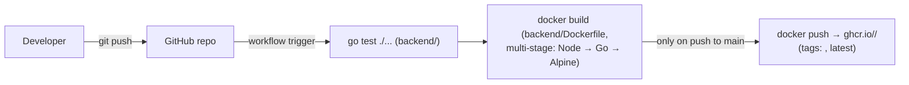

# 11 — CI/CD & Deployment Pipeline (₹0 / $0 constraint)

## Status

**CI is implemented and running. CD/deployment was implemented, then removed; no deploy stage exists today.**

- ✅ **CI** (`.github/workflows/ci.yml`): on every push/PR, runs `go test ./...` against the backend, builds the multi-stage Docker image, and — on push to `main` — pushes it to `ghcr.io/<owner>/<repo>`, tagged with the commit SHA and `latest`, authenticated via the workflow's own `GITHUB_TOKEN`.
- ⛔ **CD** (previously: a self-hosted-runner "simulated VM" that pulled the freshly-built image and ran `docker compose up -d`) was designed, implemented, and then **removed**. `.github/workflows/deploy.yml` and the supporting `deploy/` directory no longer exist in the repository.
- 🔜 **Deployment target**: currently undecided. There is no automated or manual deploy step beyond CI publishing the image. The working, demonstrable path today is local `docker compose up` (see `GETTING_STARTED.md`).

The rest of this document is split into two parts: what's actually running today (CI), and the removed CD design preserved as historical reference (in case a self-hosted-runner approach, or a variant of it, is revisited later).

## What's running today: CI

- **Test**: `go test ./...` inside `backend/` (runs on every push and PR; the integration-lite Redis tests still skip without live Redis — see `10-testing-strategy.md`).
- **Build**: `docker build` using the existing 3-stage `backend/Dockerfile`, on every push and PR, not gated on branch.
- **Push**: only on `push` to `main`, authenticated to `ghcr.io` via the automatically-provided `GITHUB_TOKEN` (`packages: write` scope) — no separate secret or account needed.

This stage runs entirely on GitHub's own free-tier, GitHub-hosted runners.

## Historical design: the removed self-hosted-runner CD stage

**⛔ Removed.** This section is preserved as design history — it does not describe anything currently running or planned.

The removed design deployed the freshly-built image onto a **self-hosted GitHub Actions runner** — a container, run under the user's own Docker, standing in for a cloud VM (e.g. an EC2 instance) at $0 with no card and no cloud account. The CD job would `docker compose pull` the image plus the standard `postgres`/`redis`/`prometheus`/`grafana`/`nginx` images, then `docker compose up -d` to bring up the full stack on that self-hosted-runner container. Prometheus/Grafana, already part of the same stack, would provide the live-dashboard showcase artifact; the demonstrable outputs would have been screenshots/recordings of a green CI+CD run and a live Grafana dashboard, since the "VM" never left the user's own machine and had no persistent public URL.

Why every component in that design was genuinely free (kept for reference, since the reasoning is still valid if this is revisited):

| Component | Classification | Why |
|---|---|---|
| GitHub Actions (CI, GitHub-hosted runner) | GENUINELY FREE | Unlimited minutes for public repos; 2,000 free minutes/month for private, no card required. |
| GitHub Container Registry (ghcr.io) | GENUINELY FREE | Free, unlimited storage/bandwidth for public images tied to a public repo, no card. |
| Self-hosted runner (simulated-VM container) | GENUINELY FREE | Runs on the user's own machine under their own Docker — no cloud provider, no VM rental, no card. |
| Compose images (`postgres`, `redis`, `prometheus`, `grafana`, `nginx`) | GENUINELY FREE | Open-source, publicly published, no licensing/usage fee. |
| Monitoring (Prometheus + Grafana) | GENUINELY FREE | Self-hosted, no SaaS/managed-monitoring tier. |

Why it was removed is a product/scope decision, not a technical failure of the design (see `06-deployment.md` for the current status and `adr/0007-cicd-pipeline.md` for the full decision record, now marked accepted-then-reverted).

## Relationship to other docs

- `06-deployment.md` is the single source of truth for current deployment status — read that doc first for "what's actually true right now."
- `adr/0007-cicd-pipeline.md` records the pipeline decision and its later reversal, including why the earlier cloud-VM alternatives (Oracle Always-Free, Render, Cloud Run — see `adr/0005`) were rejected before the self-hosted-runner design was chosen.
- `10-testing-strategy.md`'s CI-wiring proposals are partially realized by the CI stage described above; the still-open items (Postgres/Redis service containers in CI, frontend tests) remain 🔜 Proposed.
